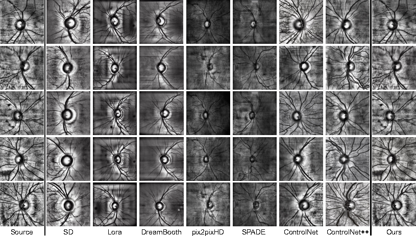
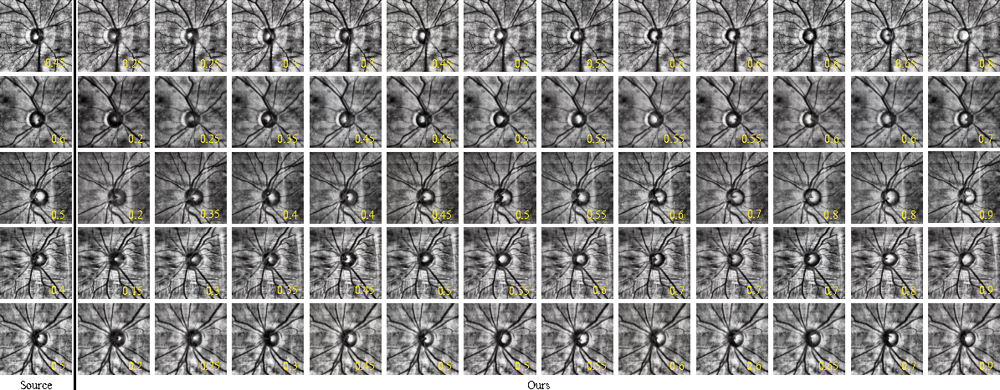

# ControlGlaucoma: Explicit Clinical Biomarker-Controllable Scanning Laser Ophthalmoscopy Fundus Image Generation for Glaucoma Diagnosis

[](./LICENSE)
[](https://www.python.org/)
[](https://pytorch.org/)
[](https://huggingface.co/ZihengWang/ControlGlaucoma)

<p align="center">
  
  <br>
  
</p>

ControlGlaucoma is a ControlNet–Stable-Diffusion-2.1 generator that synthesises Scanning Laser Ophthalmoscopy (SLO) fundus images with the **vertical cup-to-disc ratio (vCDR)** held to a user-supplied clinical target. The released weights are trained on Harvard-FairSeg.

---

## 🛠️ Installation

```bash
git clone https://github.com/WANG-ZIHENG/ControlGlaucoma.git
cd ControlGlaucoma

conda create -n controlglaucoma python=3.10 -y
conda activate controlglaucoma

pip install -r requirements.txt
mim install mmengine
mim install "mmcv>=2.0.0rc4"
```

Tested with PyTorch 2.1 / CUDA 11.8 on a single NVIDIA GeForce RTX 4090 (24 GB) GPU.

---

## 📁 Data Preparation

The released ControlNet is trained on the **Harvard-FairSeg** subset, following the dataset preparation used in our earlier project [GlaucoDiff](https://github.com/WANG-ZIHENG/GlaucoDiff).

Download the raw images from [Harvard-FairSeg](https://github.com/Harvard-Ophthalmology-AI-Lab/FairSeg) and arrange them as:

```
<DATA_ROOT>/fairseg/
├── All/                # raw .npz files (one per case, from Harvard-FairSeg)
├── data_summary.csv    # demographic attributes + train/val/test split
└── filter_file.txt     # filenames kept for training
```

`data_summary.csv` and `filter_file.txt` are shipped in this repository under [`data_info/`](data_info) and are also mirrored in [`WANG-ZIHENG/GlaucoDiff/data/10k`](https://github.com/WANG-ZIHENG/GlaucoDiff/tree/main/data/10k). Place them next to the `All/` directory:

```bash
cp data_info/data_summary.csv data_info/filter_file.txt <DATA_ROOT>/fairseg/
```

Cup/disc segmentation masks are read directly from the `disc_cup_mask` field inside each `.npz` file, so no separate mask directory is required.

Harvard-FairVLMed10K is only needed for the downstream glaucoma-classification evaluation, not for training the generator.

---

## 📦 Pre-trained Checkpoints

Hosted on the Hugging Face Hub:
[**ZihengWang/ControlGlaucoma**](https://huggingface.co/ZihengWang/ControlGlaucoma).

| Folder | Description |
|---|---|
| `controlnet_vpred/` | **Main weight.** Released ControlGlaucoma checkpoint on SD 2.1 (v-prediction). For inference. |
| `controlnet_eps/` | ε-prediction variant (paired with SD 2.1-base, 512 px). For inference. |
| `segman_b/` | SegMAN-B segmentation model used as the reward signal. |

```bash
huggingface-cli download ZihengWang/ControlGlaucoma \
  --local-dir ./checkpoints \
  --local-dir-use-symlinks False
```

The training demo (`train/demo_train.sh`) does **not** initialize from `controlnet_vpred/`. It starts from the publicly hosted ControlNet baseline [`thibaud/controlnet-sd21-ade20k-diffusers`](https://huggingface.co/thibaud/controlnet-sd21-ade20k-diffusers), automatically fetched from the Hugging Face Hub on first run.

---

## 🚀 Inference

```bash
cd train
python generate_images.py \
  --pretrained_model_name_or_path=stabilityai/stable-diffusion-2-1 \
  --controlnet_model_name_or_path=../checkpoints/controlnet_vpred \
  --dataset_name=<DATA_ROOT>/fairseg \
  --output_dir=./generated_images \
  --num_inference_steps=30 \
  --reward_model="segman::../SegMAN/segmentation/local_configs/segman/base/segman_b_ade.py::../checkpoints/segman_b/segman_b.pth" \
  --use_filter
```

### vCDR-controlled generation

To synthesise images at multiple target vCDR values from the same source, add `--gen_scale_masks`. For each source image, the OC (cup) region in the masked condition image is scaled around its fixed center in increments of 0.05, on top of the source vCDR. Each candidate is kept only if the resulting vCDR lies in `[0.10, 0.90]` and the scaled OC stays strictly inside the OD (checked via polygon containment with a 4-pixel buffer); enlargement halts as soon as the OC boundary would intersect the OD boundary.

```bash
python generate_images.py \
  # ... same arguments as above ... \
  --gen_scale_masks
```

Outputs are written to `<output_dir>/<model_tag>/scale/`, one image per accepted target vCDR alongside the source image.

---

## 🔄 Training (Demo)

```bash
cd train
bash demo_train.sh
```

`demo_train.sh` runs the reward fine-tuning procedure on top of the publicly hosted ControlNet baseline [`thibaud/controlnet-sd21-ade20k-diffusers`](https://huggingface.co/thibaud/controlnet-sd21-ade20k-diffusers). It reads `DATA_ROOT`, `CKPT_ROOT`, `OUTPUT_DIR`, and `BASE_CONTROLNET` from the environment.

Hyperparameters reported in the paper (full CLI list via `python finetune_controlnet.py --help`):

| Flag | Value | Meaning |
|---|---|---|
| `--prediction_type` | `v_prediction` | SD scheduler parametrisation |
| `--resolution` | `512` | input is center-cropped and resized to 512×512 |
| `--train_batch_size` | `2` | per-step batch size |
| `--max_train_steps` | `8000` | total optimisation steps |
| `--learning_rate` | `5e-5` | constant LR after warmup |
| `--lr_scheduler` | `constant_with_warmup` | LR schedule |
| `--lr_warmup_steps` | `30` | warmup steps |
| `--adam_beta1` / `--adam_beta2` | `0.9` / `0.999` | AdamW betas |
| `--adam_weight_decay` | `1e-2` | AdamW weight decay |
| `--reward_loss_weight` | `1.0` | λ on the cross-entropy reward |
| `--cup_disc_loss_weight_v1_1` | `1.0` | λ on the vCDR loss |
| `--vcdr_loss_alpha` | `10.0` | softmax temperature for the Φ_y row pooling |
| `--loss_weight_strategy` | `fixed_timestep` | apply reward only at `t ≤ max_timestep_rewarding` |
| `--max_timestep_rewarding` | `800` | upper bound of the reward timestep window |

---

## 🗂️ Repository Layout

```
ControlGlaucoma/
├── README.md
├── LICENSE
├── requirements.txt
├── Figure1.png  Figure2.png
├── train/
│   ├── finetune_controlnet.py       # fine-tuning entry
│   ├── train_controlnet.py          # vanilla ControlNet trainer
│   ├── generate_images.py           # inference / generation
│   ├── vcdr_loss.py
│   ├── eval_single_step_visualize.py
│   ├── eval_generated_vcdr.py
│   ├── postprocess_*.py
│   ├── demo_train.sh                # fine-tuning demo
│   ├── train_CLIP/clip_score/
│   └── ...
├── SegMAN/                          # SegMAN-B segmentation evaluator
├── TransUNet_networks/
├── eval/
├── mmlab/mmseg/
└── data_info/                       # FairSeg split files
```

---

## 📑 Citation

```bibtex
@article{wang2026controlglaucoma,
  title  = {ControlGlaucoma: Explicit Clinical Biomarker-Controllable Scanning Laser Ophthalmoscopy Fundus Image Generation for Glaucoma Diagnosis},
  author = {Wang, Ziheng and Lin, Yan and Chen, Wen and Zhang, Zhen and Yu, Qinkai and Ning, Jiliang and Zang, Wenrui and Zhou, Sheng and Hamdi, Abdullah and Tian, Yu and Zheng, Yalin and Edward, Deepak P. and Gao, Xin and Meng, Yanda},
  year   = {2026}
}
```

---

## 🙏 Acknowledgments

- Built upon [ControlNet++](https://github.com/liming-ai/ControlNet_Plus_Plus) and [Stable Diffusion 2.1](https://github.com/Stability-AI/stablediffusion).
- Datasets: [Harvard-FairSeg](https://github.com/Harvard-Ophthalmology-AI-Lab/FairSeg), [Harvard-FairVLMed10K](https://github.com/Harvard-Ophthalmology-AI-Lab/FairCLIP).
- Reward segmentation: [SegMAN](https://github.com/yunxiangfu2001/SegMAN).
